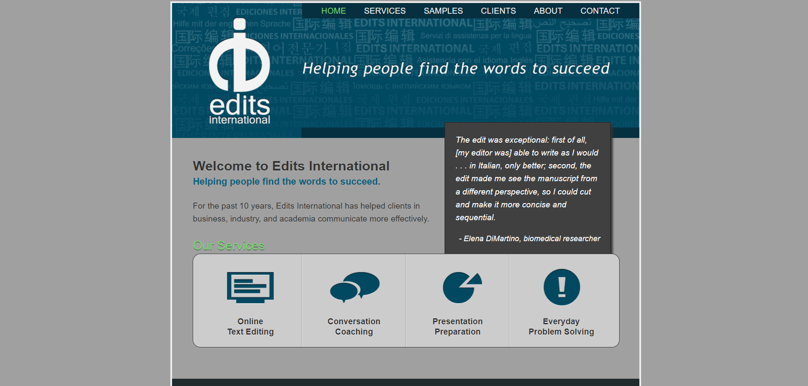
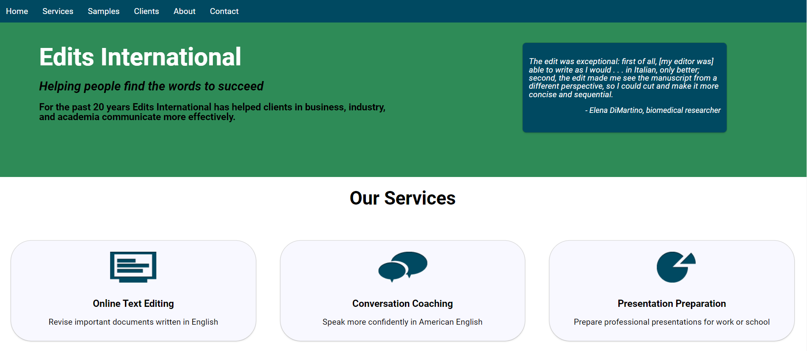
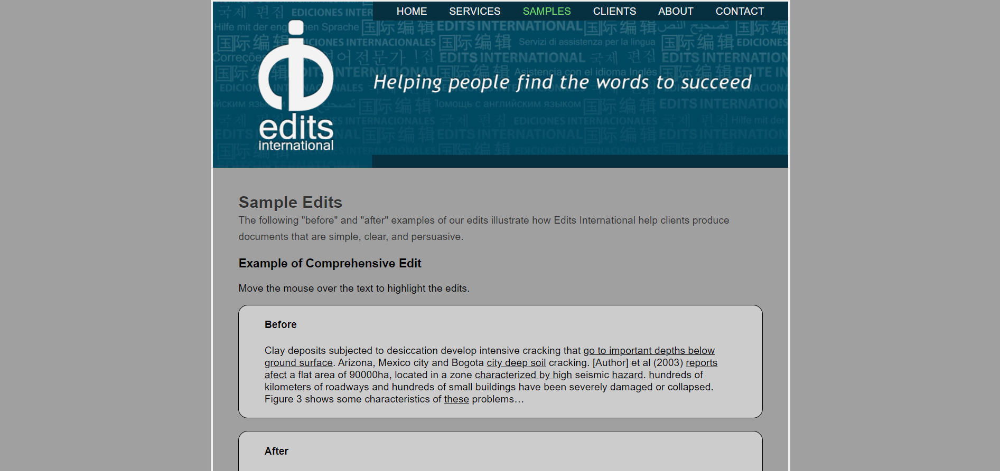
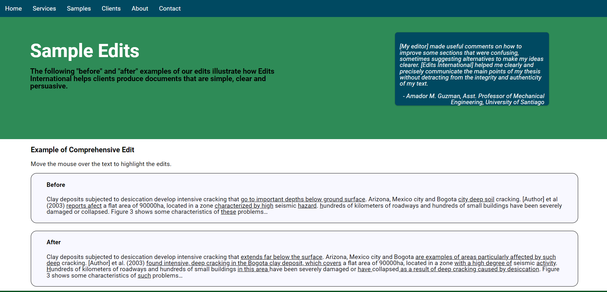
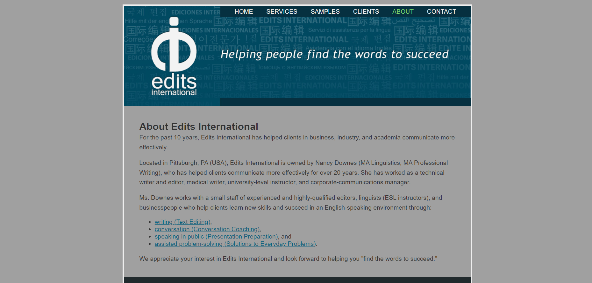
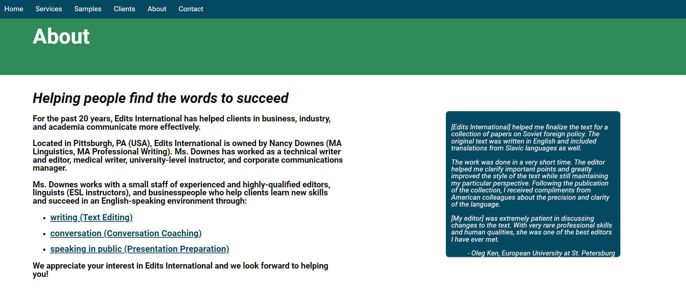

# Edits International

## Introduction

Edits International is the name of my wife's business. The website is no longer live because her business model has changed. 
The first version of the website did not have a working contact form and was not fully mobile-responsive. There wasn't a need for that at the time.
With no previous experience in HTML or CSS, I got the contact form working, improved the responsivity, and updated the look.

Below are screenshots that help illustrate what I did.

Home page, old and new:

Samples page, old and new:

About page, old and new:

## Technologies Used

HTML, CSS and PHP

## Getting Started

I took on this project during a period when I had some time on my hands.  My wife had been hoping to update her site and she'd lost touch with the original developer.  I'd always been interested in coding and I was willing to give this a try.  It was a struggle, to say the least.  But I persevered, and my wife was pleased with the finished product.

## Unsolved Problems

My wife and I would have liked to preserve the original logo, but I couldn't incorporate it into the new look of the site without creating a lot of problems.   

## Future Enhancements

It might be fun to revisit this project now that I've been through a MERN stack boot camp and have a lot more software development experience. 

## Miscellaneous
To access these project files you can fork and clone the repository to your computer.  The repo link is https://github.com/johnvresilovic/edits-international.git.

Thanks to Devslopes.com for tutorials that were tremendously helpful.

Contact info: johnvresilovic@protonmail.com